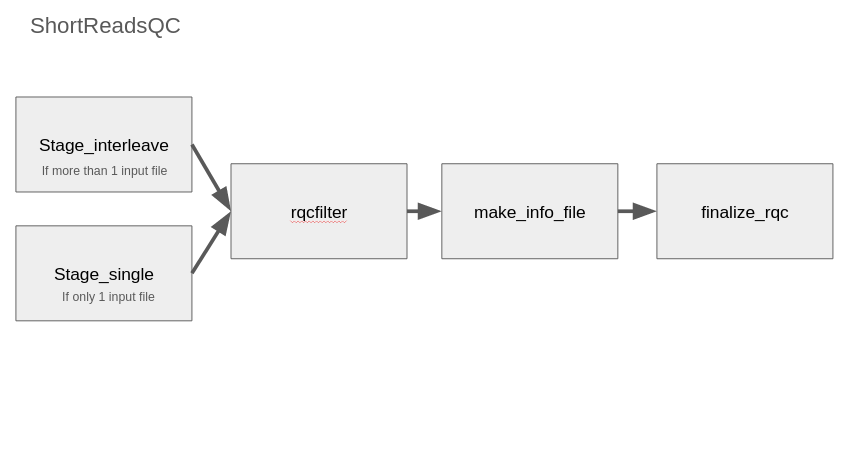

# Ernakovich lab Meta'omics tutorial Part 1: The Data Preprocessing workflow
**NOTE:** *This has been modified to run on the Ernakovich HPC setup (premise) by Hannah Holland-Moritz*

*If you find this tutorial helpful or useful, please let us know, it really helps us out to know how many people are finding it useful, thanks!
Updated July 25, 2024*

## Summary
This workflow is a replicate of the [QA protocol](https://jgi.doe.gov/data-and-tools/software-tools/bbtools/bb-tools-user-guide/data-preprocessing/) implemented at JGI for Illumina reads and use the program “rqcfilter2” from BBTools(38:96) which implements them as a pipeline. 

We suggest opening the tutorial online to understand more about each step. The original pipeline on which this tutorial is based can be found here: [https://nmdc-edge.org/tutorial](https://nmdc-edge.org/tutorial)

If your data is small enough, consider using the NMDC Edge web interface it's very nice and a good place for beginners to get their feet wet: [https://nmdc-edge.org/home](https://nmdc-edge.org/home)

## Getting started
The goal of the workflow in this repository is to take sequencing data and clean it in preparation for downstream processes. Specifically we'll be using it as the first step in our laboratory's 'Omics workflow system.

### Why go to the hassel of WDL?
Bioinformatics often requires running a series of the same programs on similar files over and over again. Therefore it can be useful to use a workflow management system that strings these varioius scripts and steps together so that the processing pipeline is repeatable, reliable, and easily documentable. One way of doing this is to use WDL ([Workflow Description Language](https://docs.openwdl.org/en/stable/)) to describe your workflow and all of its component parts. [Cromwell](https://cromwell.readthedocs.io/en/stable/) is a workflow management system developed by the Broad Institute geared towards implementing scientific workflows. Essentially Cromwell can be used to ready `*.wdl` files and actually do the hard work of running and documenting your bioinformatics workflow in real time. 

## Setup (part 1) - Steps before starting pipeline

### Before you begin:

#### Clone or Download this tutorial from github
Once you have logged in, you can download a copy of the tutorial and workflow into your directory on the server. To retrieve the folder with this tutorial from github directly to the server, type the following into your terminal and hit return after each line.

```bash
wget https://github.com/ErnakovichLab/ReadsQC.git
unzip main.zip
```
If there are ever updates to the tutorial on github, you can update the contents of this folder by downloading the new version from the same link as above.

#### Install Cromwell
Cromwell is a java based program and requires java 11 or greater to run. Cromwell is the software that does the heavy lifting for us in interpreting the WDL language and orchestrating the workflow. The default java version on premise is below what Cromwell requires. Therefore we will install java and Cromwell in an anaconda environment which we will invoke prior to running the pipeline. 

```bash
# load anaconda on the premise HPC
module load anaconda/colsa

# Create the environment and install cromwell and its java dependencies
conda create -n cromwell -c bioconda cromwell

# After installation is complete
conda activate cromwell

# Download the cromwell jar file (you'll want to save this somewhere where you won't delete it and can find it later)
mkdir cromwell
cd cromwell
wget https://github.com/broadinstitute/cromwell/releases/download/87/cromwell-87.jar
```

(Note currently we don't actually run cromwell from this environment directly, we mostly just rely on it for the java. This is because I have no idea where the cromwell jar file is in the depths of the conda environment...)

#### Installing singularity images on premise
##### Some background about singularity and containers
One of the reasons this workflow is so portable is that it relies on the use of containers for its software needs. Often one of the most challenging parts of implementing a repeatable bioinformatics workflow is installing the software. Too often, software from one step conflicts with software from a downstream step, or the workflow works on one operating system but not all. In the past these difficulties could be prohibitive to replication of a workflow, the use of containers helps solve that problem. Containers essentially spoof a program into thinking it is running on the kind computer/operating system they need to run with all the dependencies the need to run correctly.

One of the most popular kinds of container software is Docker. All of the necessary programs to run this workflow have been saved as Docker containers by the folks at NMDC. However most HPC systems (like premise) don't use Docker since it requries each user to have administrator level access to use effectively. Instead, many HPC systems prefer to use [Singularity](https://docs.sylabs.io/guides/3.0/user-guide/quick_start.html) which is safter to use and can seamlessly import Docker containers.

##### Preparing and installing singularity containers
For Ernakovich lab users, I have installed the singularity containers in our shared directory. Therefore, all you need to do is create "symlinks" (symbolic links - this is kind of analogous to a shortcut on your desktop machine) that link to the Singularity containers in `/mnt/home/ernakocvich/shared/SingularityImages` 

Create a symlink to the singularity directory. 

```bash
cd ReadsQC
ln -s /mnt/home/ernakovich/shared/software/SingularityImages microbiomedata
ln -s /mnt/home/ernakovich/shared/software/SingularityImages bfoster1
```

If you are not on premise or in the Ernakovich lab, you'll need to install the images in your own directory before creating the symlinks above (replace the ernakovich path with the path to the location of your own SingularityImages folder). Note that the image names need to include the numbers and colons so that they match the names of the containers in the .wdl files exactly, which is why we change their names:
```bash
module load singularity
cd ReadsQC
mkdir SingularityImages
cd SingularityImages
singularity pull img-omics docker://bfoster1/img-omics:0.1.1
singularity pull pbmarkdup docker://microbiomedata/pbmarkdup:1.0
singularity pull bbtools docker://microbiomedata/bbtools
singularity pull workflowmeta docker://microbiomedata/workflowmeta:1.1.1

# Change the names to match wdl calls
mv bbtools bbtools:38.96
mv img-omics img-omics:0.1.9
mv pbmarkdup pbmarkdup:1.0
mv workflowmeta workflowmeta:1.1.1
```

#### Other less common setup steps
##### Make sure the Required Database is Installed
This workflow requires the RQCFilterData database which is quite large. Luckily the wonderful premise sysadmins have installed it for us in the premise shared database folder: `/mnt/home/hcgs/shared/databases/readsqc/refdata`

So if you are working on premise, you won't need to do anything special.

However if you are not working on premise and need to install it yourself, follow the instructions below. Then replace all instances of `/mnt/home/hcgs/shared/databases/readsqc/refdata` in the shortReads.wdl file with the path to the database on your system.

* [RQCFilterData Database](https://portal.nersc.gov/cfs/m3408/db/RQCFilterData.tgz): It is a 106G tar file includes reference datasets of artifacts, adapters, contaminants, phiX genome, host genomes.  

* Prepare the Database

```bash
	mkdir -p refdata
	wget https://portal.nersc.gov/cfs/m3408/db/RQCFilterData.tgz
	tar xvzf RQCFilterData.tgz -C refdata
	rm RQCFilterData.tgz
```
## Setup (part 2) - Creating your JSON input files
### Prepare JSON files
Cromwell and WDL workflows expect in put formated in Json (Javascript object notation) format. JSON format is a compact way of storing information. It typically involves lists of bracketed category-value pairs, separated by colons. The ReadsQC pipeline requires the following format of json for each read-pair it processes:

1. database path, 
2. fastq (illumina paired-end interleaved fastq), or two paired end fastq files (can be gzipped). 
3. project name (arbitrary name, used for naming output files)
4. ~~resource where run the workflow~~ (this is not used on the premise implementation and can be removed)
5. informed_by 

```
{
    "nmdc_rqcfilter.database": "/global/cfs/projectdirs/m3408/aim2/database", 
    "nmdc_rqcfilter.input_files": "/global/cfs/cdirs/m3408/ficus/8434.3.102077.AGTTCC.fastq.gz", 
    "nmdc_rqcfilter.proj":"nmdc:xxxxxxx",
    "nmdc_rqcfilter.resouce":"NERSC -- perlmutter",
    "nmdc_rqcfilter.informed_by": "nmdc:xxxxxxxx"
}
```

##### Making many JSON files at once
You must create one of these files for each of the samples you want to process. Since this can be quite tedious to do by hand, I have created a script that can be used to create json files if given a directory of reads. 

[https://github.com/hhollandmoritz/PrepareNMDCJSONs/tree/main]()

Download the script
```
wget https://github.com/hhollandmoritz/PrepareNMDCJSONs/archive/refs/heads/main.zip
unzip main.zip
cd PrepareNMDCJSONs-main
```

To use the `fastq_to_json.py` script:
```
python fastq_to_json.py -i <full/path/to/directory/with/reads> -o <full/path/to/my_proj_jsons> -f "R1" -r "R2" -p MyProjectName -s True
```
This will create a directory called `my_proj_jsons` that contains a json input file for each read pair in the directory you point it to.

## Run workflow (part 3) - Launching single and multiple jobs

### Running one sample to test the pipeline
Although the most likely reason you are using this pipeline on premise is because you have many samples to run, it is always a good idea to run a couple of test samples through your pipeline first to make sure everything is working as expected, and to get a sense for how much computing resources running these samples will take. I recommend using a small, medium, and large-complexity (file size is a good proxy) sample to test. 

#### Choose some test samples
Generate an ordered list of samples by file size (assume your reads are in a directory called "my_reads"):
```
cd my_reads
du -sh  * | sort -k1 -rh
```

Choose 3 sets of reads to test out from the top, middle, and bottom of this list to get a sense for the time, memory consumption, and computational needs of your dataset.

#### Modify the slurm submission script 
There are two kinds of slurm scripts we'll cover in this tutorial. One is for single jobs (`submit.sh`) the other is for multiple samples (`submit_array.sh`).

Open `submit.sh` for editing using `nano` or your favorite text editor for the terminal.

```
cd ReadsQC
nano submit.sh
```

Scroll down. After the slurm settings (lines starting with `#SBATCH`), you'll see the call to load the environment:

```bash
## Load the appropriate modules first.  Linuxbrew/colsa contains most
## programs, though some are contained within the anaconda/colsa
## module.  Refer to http://premise.sr.unh.edu for more info.
module purge
module load anaconda/colsa
conda activate cromwell # we mostly just use this for the java. We'll invoke the jar file 87 directly

module load singularity
```
These lines load both the anaconda environemnt that provides the version of java required by Cromwell, and loads the singularity module, so that we'll be able to use singularity containers.


Next, move to the bottom of the script and edit the cromwell submission line.
 * After `-jar` You'll want to change the location of the cromwell jar file you downloaded earlier (make sur ethe ## matches the version of cromwell jar you downloaded)
 * change the name of the metadat_out.json file to be more descriptive. In the testing phase, I like to name it with "small", "medium", or "large" depending on which read set I'm testing.
 *  replace `input.json` with the path to the input.json file you created in the previous step. Since you're testing three different sets of reads, this fill will be different for each read set you test. 

```bash
java -Dconfig.file=singularity.conf -jar /path/to/your/jar/file/cromwell/cromwell-##.jar run -m metadata_out.json -i input.json rqcfilter.wdl
```

After making the edits, you can save and exit out of nano (`ctrl + O`, `ctrl + X`). 

Finally, submit your script to slurm:

```bash
sbatch submit.sh
```

Now repeat the editing process for your other two sets of test samples.

### Running an array job to run all samples through the same pipeline.
 * similar process as before, except, need to specify the location of the json file output directory.
 * Also need to edit how many samples are run at once in the `#SBATCH --array` option.
  * 0-8%3 runs 9 jobs, 3 at time. We recommend taking advantage of the %# part, to limit the amount of premise usage to reasonable limits. 

Section to include:
- [] how to launch both array and single jobs
- [] the basic steps of the workflow (refer to nmdc; particularly important to define rqcfilter options)

## Modifying the workflow (Part 4)

### What is the workflow doing?:
Let's open the `rqcfilter.wdl` script to understand what the workflow is doing. 

```
cat rqcfilter.wdl
```

First we load in two sub-workflows. One for short reads (shortReadssqc.wdl) and one for long reads (longReadsqc.wdl). Most likely you'll be working with short reads (<250bp from ILlumina), so we'll focus on those. These workflows will be referred to in the task calls below. The `as srqc` part simply gives a shortcut that we'll use to refer to the wdl workflow so we don't have to type the whole thing out. 

```wdl
version 1.0
import "shortReadsqc.wdl" as srqc
import "longReadsqc.wdl" as lrqc
```

After loading the methods for short and long reads, we get to work on outlining the actual workflow. We use the `workflow` command to tell the computer we're declaring a workflow, and give its name as `rqcfilter`.

Next we specify the inputs we'll be using and what type of variable they are (strings [text], files, booleans [true/falses], arrays [lists], etc . Anything followed by a question mark in the input section optional. Inputs take the format `<variable type> <variable name>=<variable value>`. In this case the variable valeus are not specified because we've specified them in our input JSON files.

```wdl
workflow rqcfilter{
    input{
    # String  outdir
    File?   reference
    Array[String] input_files
    String  proj
    Boolean shortRead 
  }
```
After the inputs are specified comes the actual workflow call. It's an if-then statement, that relies on our input variable `shortRead` which is either true or false. If we've specified `True` in our input JSON file for shortreads, the shortReads.wdl file will be executed, otherwise, we'll execute (`call`) the longReads.wdl workflow. In both cases, we pass along some of the input variables (the files and project name, and reference in the case of the longreads).

```wdl
    if (shortRead) {
        call srqc.ShortReadsQC{
            input:
            input_files = input_files,
            proj = proj
        }
    }
    if (!shortRead) {
        call lrqc.LongReadsQC{
            input:
            file = input_files[0],
            proj = proj,
            # outdir = outdir,
            reference = reference
        }
    }
```
Finally we have the list of outputs from the pipeline. If all goes well a number of files will be generated by either the shortReads.wdl workflow or the longReads.wdl workflow and they'll be passed back to this workflow for the output of the whole pipeline. 

```wdl
    output {
        # short reads
        File? filtered_final_srqc = ShortReadsQC.filtered_final
        File? filtered_stats_final_srqc = ShortReadsQC.filtered_stats_final
        File? filtered_stats2_final_srqc = ShortReadsQC.filtered_stats2_final
        File? rqc_info_srqc = ShortReadsQC.rqc_info
        # long reads
        File? filtered_final_lrqc = LongReadsQC.filtered_final
        File? filtered_stats_final_lrqc = LongReadsQC.filtered_stats1
        File? filtered_stats2_final_lrqc = LongReadsQC.filtered_stats2
        File? filtered_stats3_final_lrqc = LongReadsQC.filtered_stats3
        File? rqc_info_lrqc = LongReadsQC.rqc_info
    }
}
```

### Changing the workflow
Let's say you want to change some of the commands run by the shortReads.wdl. How would you do that?

We'll use the heart of the shortReads.wdl pipeline as an example: the `rqcfilte2.sh` task. 

```
cat shortReads.wdl
```
If you look at the structure of the shortReads.wdl script you'll notice that it has the following structure:

```wdl
# Part 1 of the .wdl script
workflow Name {
    input{
    ...
    }
    
    call <Task name> {
    	inputs:
    }
}

# Part 2 of the .wdl script
task <Task name> {
    input {
    
    }
    command <<<
    ...
    
    <<<
    output {
    ...
    }
    runtime {
    ...
    }
}
```

At its most basic, the top of the script is the *workflow* which is composed of *tasks*, the bottom of the script defines each *task* by specifying the comand that is run happen and softaware which is run within each task. Inputs and outputs are handled for each task and the workflow as a whole. (Runtime attributes specify the amount of resources and singularity containers that are called when a task is run). This structure (a big-picture outline followed by detailed tasks or functions) is a really common way for programmers to organize scripts. It makes it easy to understand complex programs and find what you parts you need to modify. Think of it like a book. First you ouline the structure of the book in the table of contents and then each chapter and all of its details follow. 

**Exercise for consideration: ** Try drawing out the shortReads.wdl script based on the `workflow` part of the script. Use boxes and arrows to show what happens.

** Answer:**



Now that we understand the overview of the script, let's scroll down and focus on editing the call to the bbtools function `rqcfilter2.sh`:

```wdl
 rqcfilter2.sh \
            ~{if (defined(memory)) then "-Xmx" + memory else "-Xmx60G" }\
            -da \
            threads=~{jvm_threads} \
            ~{chastityfilter} \
            jni=t \
            in=~{input_fastq} \
            path=filtered \
            rna=f \
            trimfragadapter=t \
            qtrim=r \
            trimq=0 \
            maxns=3 \
            maq=3 \
            minlen=51 \
            mlf=0.33 \
            phix=t \
            removehuman=t \
            removedog=t \
            removecat=t \
            removemouse=t \
            khist=t \
            removemicrobes=t \
            sketch \
            kapa=t \
            clumpify=t \
            barcodefilter=f \
            trimpolyg=5 \
            usejni=f \
            rqcfilterdata=~{rqcfilterdata} \
            > >(tee -a  ~{filename_outlog}) \
            2> >(tee -a ~{filename_errlog}  >&2)
```
This script is meant to be a comprehensive filtering pipeline of common contaminents in microbial sequence data. But it's possible you might want to modify, or change some of the parameters. For example, the `removemicrobes=t` flag removes common microbial contaminants, such as E. coli. But if you were working with an environment dominated by E. coli, you might want to turn off this option in your pipeline. 

Learn more about the pipeline that rqcfilter2.sh carries out [here](https://jgi.doe.gov/data-and-tools/software-tools/bbtools/bb-tools-user-guide/data-preprocessing/). Since RQCfilter is a pipeline, each step has its own documentation. I've tried to specify the meanings of each default flag here but refer to the documentation for full information.

```
```wdl
 rqcfilter2.sh \
            ~{if (defined(memory)) then "-Xmx" + memory else "-Xmx60G" }\ # java memory options
            -da \ # java disable assertions setting, no need to touch
            threads=~{jvm_threads} \ # number of threads to use
            ~{chastityfilter} \ # removes reads that fail illumina filtering
            jni=t \
            in=~{input_fastq} \ # your input file (interleaved)
            path=filtered \ # output destination
            rna=f \
            trimfragadapter=t \ # trim all known illumina adapter sequences
            qtrim=r \ # trim read ends to remove bases < minq (r is right end only)
            trimq=0 \ # average quality below wich to trim, 
            maxns=3 \ # reads can have no more Ns than this
            maq=3 \  # min average quality of reads after trimming
            minlen=51 \ # minimum length of reads after trimming
            mlf=0.33 \ # min length fraction, (acceptable length fraction of a full-length read)
            phix=t \ # remove phiX genome
            removehuman=t \ # remove human contaminant sequences
            removedog=t \ # remove dog contaminant sequences
            removecat=t \ # remove cat contaminant sequences
            removemouse=t \ # remove mouse contaminant sequences
            khist=t \ # generate a Kmer frequency histogram
            removemicrobes=t \ # remove common microbial contaminants and place in separate file
            sketch \ # runs sendsketch.sh; compares query sequences to a reference database fast.
            kapa=t \ # removes kapa contamination
            clumpify=t \ # run clumpify - helps with de-duplication steps
            barcodefilter=f \ # detect if improper barcodes are used
            trimpolyg=5 \ # trim reads that start or end with polyGs at least 5 bp long
            usejni=f \
            rqcfilterdata=~{rqcfilterdata} \ # path to RQCfilter database
            > >(tee -a  ~{filename_outlog}) \
            2> >(tee -a ~{filename_errlog}  >&2)
```

After modifying and saving the rqcfilter task (or any other task) to your liking, you can save the shortReads.wdl file and run the workflow.

## After running workflow (part 5)
- [] Interpret the output (where aremy files!)
- [] modifying the workflow
- [] dealing with failed samples

## Other information
### Running Workflow in Cromwell

Description of the files:
 - `.wdl` file: the WDL file for workflow definition
 - `.json` file: the example input for the workflow
 - `.conf` file: the conf file for running Cromwell.
 - `.sh` file: the shell script for running the example workflow

### The Docker images and Dockerfile can be found here
[microbiomedata/bbtools:38.92](https://hub.docker.com/r/microbiomedata/bbtools)

### Input files

1. database path, 
2. fastq (illumina paired-end interleaved fastq), 
3. project name 
4. resource where run the workflow
5. informed_by 

```
{
    "nmdc_rqcfilter.database": "/global/cfs/projectdirs/m3408/aim2/database", 
    "nmdc_rqcfilter.input_files": "/global/cfs/cdirs/m3408/ficus/8434.3.102077.AGTTCC.fastq.gz", 
    "nmdc_rqcfilter.proj":"nmdc:xxxxxxx",
    "nmdc_rqcfilter.resouce":"NERSC -- perlmutter",
    "nmdc_rqcfilter.informed_by": "nmdc:xxxxxxxx"
}
```

### Output files

The output will have one directory named by prefix of the fastq input file and a bunch of output files, including statistical numbers, status log and a shell script to reproduce the steps etc. 

The main QC fastq output is named by prefix.anqdpht.fast.gz. 

```
|-- 8434.1.102069.ACAGTG.anqdpht.fastq.gz
|-- filterStats.txt
|-- filterStats.json
|-- filterStats2.txt
|-- adaptersDetected.fa
|-- reproduce.sh
|-- spikein.fq.gz
|-- status.log
|-- ...
```

### List of changes made for adapting to Premise:
- [x] changed the database location in *.wdl files to the premise shared database location (`/mnt/home/hcgs/shared/databases/readsqc/refdata`) 
- [ ] modified the `input.json` file to use the E.coli reads in the `test/` directory.
- [ ] extensive modifications to shifter.conf (soon to be renamed singularity.conf)
  - Docker root is changed to be full path to cromwell-executions file within ReadsQC (note, should add information to readme that this is configurable location)
  - Bound the database directory and data directories to the loading of singularity container; will need to add information to readme about how to do this. Ideally, we'd find a way to specify this in the json file rather than as runtime attributes.
- [ ] changed the names of the containers in the wdl files to reflect the names that were originally used. (this minimizes user changes to run) 
- [ ] added the database location to runtime options so that it could be bound to the singularity call
- [ ] modified the submission script to include the working call to cromwell jar file and also to load the singularity module
